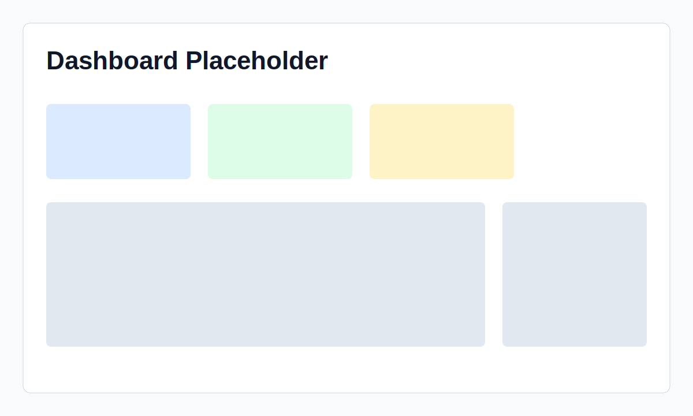
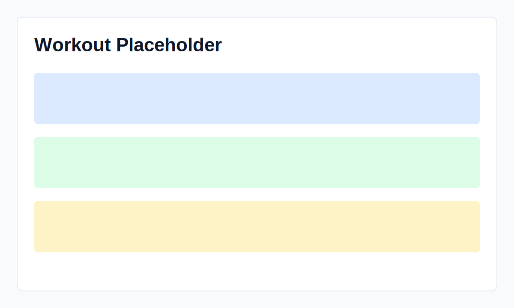
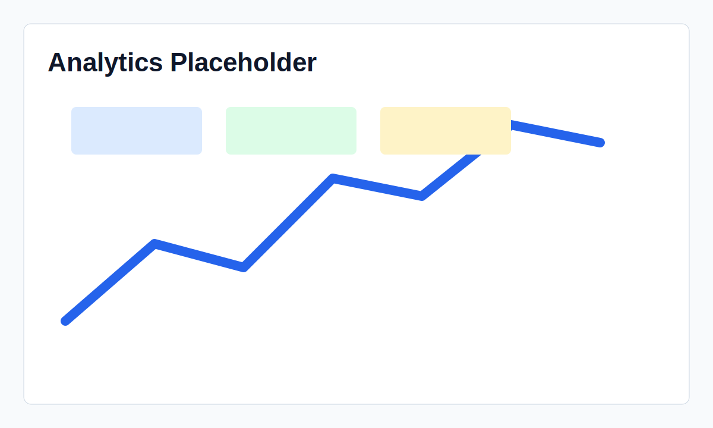

# StrongLifts 5x5 Tracker

A production-ready Next.js App Router PWA for tracking the classic StrongLifts 5x5 program: alternating A/B workouts, progression, deloads, workout history, body weight, charts, notes, and local email/password authentication.





## Features

- Local auth with hashed passwords and secure HTTP-only session cookies.
- StrongLifts A/B scheduling with automatic progression: +2.5 kg for Squat, Bench, Row, Press and +5 kg for Deadlift.
- Failure tracking with 10% deload after 3 consecutive misses.
- Workout editor with sets, reps, weight, completion checks, exercise notes, workout notes, autosave, and rest timers.
- Smart workout screen with editable warm-up sets, previous workout comparison, plate loading, working sets, assistance work, notes, and timers in one mobile-friendly flow.
- Warm-up generator based on the scheduled working weight. Warm-ups are stored separately and excluded from progression calculations.
- Assistance exercise library, custom assistance exercises, and assistance templates. Assistance appears in history and volume analytics but does not affect StrongLifts progression.
- Olympic plate calculator with configurable bar weight and plate inventory.
- Onboarding for starting weights plus a current working weights screen for manual future-weight adjustments.
- Dashboard, history filters, Recharts analytics, body-weight trend, weekly averages, e1RM, total volume, and personal records.
- Settings for units, increments, deload percentage, timer durations, and dark mode preference.
- CSV, Excel, JSON backup, and JSON restore.
- SQLite and Prisma migrations, seed data, unit tests, PWA manifest/service worker, Docker support, mobile-first Tailwind UI.

## Quick Start

```bash
cp .env.example .env
npm install
npm run db:migrate
npm run db:seed
npm run dev
```

Open [http://localhost:3000](http://localhost:3000).

Demo account:

```text
demo@stronglifts.local
password123
```

## Useful Commands

```bash
npm run test
npm run build
npm run db:studio
npm run db:deploy
```

## Docker

```bash
docker compose up --build
```

The compose file persists the SQLite database in a named volume.

## Project Structure

```text
src/app              App Router pages and API routes
src/components       Client and server UI components
src/lib              Auth, Prisma, program logic, analytics, validation
prisma               Schema, migration, seed data
public               PWA manifest, icon, service worker
```

## Database

The Prisma schema includes users, settings, exercises, workouts, workout exercises, sets, body weight entries, personal records, and daily notes. Migrations live in `prisma/migrations`.

## Screenshots

The README uses placeholder screenshot paths so teams can replace them with real captures after branding and deployment:

- `docs/screenshots/dashboard-placeholder.svg`
- `docs/screenshots/workout-placeholder.svg`
- `docs/screenshots/analytics-placeholder.svg`
